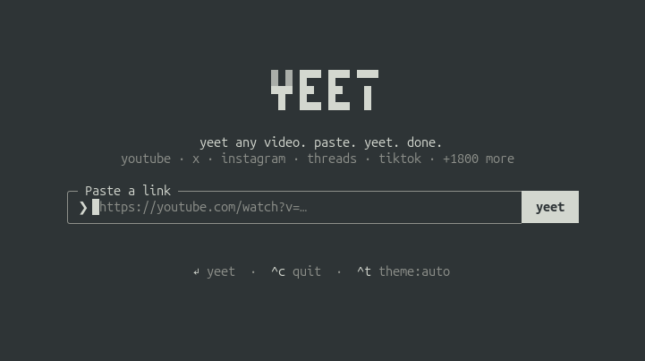
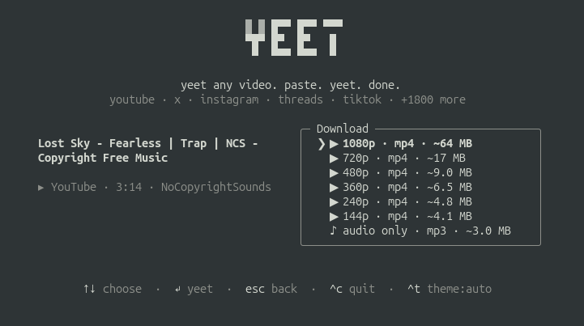

<div align="center">

<picture>
  <source media="(prefers-color-scheme: dark)" srcset="assets/logo-dark.svg">
  
</picture>

**Yeet any video. Paste. Yeet. Done.**

Download from YouTube, X/Twitter, Instagram, Threads, TikTok and 1,800+ other
sites — right from your terminal.

[](https://www.npmjs.com/package/yeet)
[](https://www.npmjs.com/package/yeet)
[](package.json)
[](LICENSE)

Created by [MaxEdgar](https://github.com/MaxEdgar)



</div>

Paste a url, pick a resolution (or audio-only mp3), done. No popups, no fake
download buttons, no sketchy redirects.

## Install

```sh
npm install -g yeet
```

Or try it without installing anything:

```sh
npx yeet
```

Requires Node 18+. Everything else (yt-dlp, ffmpeg) is fetched or bundled
automatically.

## Usage

```sh
yeet https://youtu.be/dQw4w9WgXcQ    # straight to the format picker
yeet                                 # prompts for a url
yeet --theme light                   # force the light palette
```

Yeet takes over the terminal — full-screen, centered, and it restores your
scrollback on exit. Pick a format with `↑`/`↓` (or `j`/`k`, or number keys)
and hit enter. `esc` goes back, `^c` quits. Or just use the mouse — the yeet
button, the format list, and the footer hints are all clickable, and clicking
the logo takes you home. Files are saved to `~/Downloads`, with the final
path printed once the download finishes.

The default `auto` theme borrows your terminal's own foreground and
background, so it follows light and dark terminal themes without guessing.
Press `^t` or click the theme control in the footer to cycle through `auto`,
`light`, and `dark` for the current session. Use `--theme auto`,
`--theme light`, or `--theme dark` to set the starting theme for one launch.

<div align="center">

</div>

## How it works

**Extraction** — Powered by [yt-dlp](https://github.com/yt-dlp/yt-dlp). On
first run, yeet downloads the standalone binary to `~/.yeet/bin`, no Python
required. If you already have yt-dlp installed, it uses yours.

**Muxing** — `ffmpeg` is found on your PATH when available, with
`ffmpeg-static` bundled as a fallback, for merging high-res streams and mp3
extraction.

**Interface** — Built with [Ink](https://github.com/vadimdemedes/ink) —
React for the terminal.

## Development

```sh
npm install
npm run build        # bundle to dist/ with tsup
npm run dev          # rebuild on change
node dist/cli.js <url>
npm run typecheck
```

To try it as a global command without publishing: `npm link`, then run
`yeet` anywhere.

## Use responsibly

Yeet is built for personal archiving, not for skirting a platform's rules.
Some sites' terms of service restrict downloading their content — that's on
you to check. Keep what you're entitled to keep, credit the people who made
it, and don't use this to rip off creators.

## License

[MIT](LICENSE)
